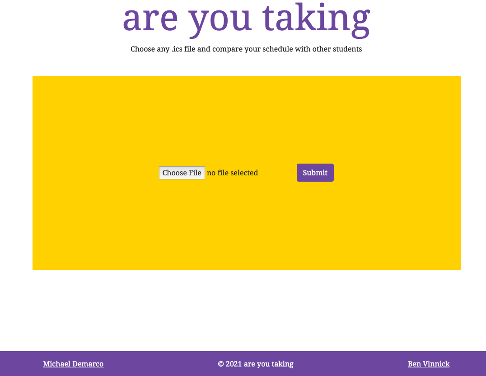
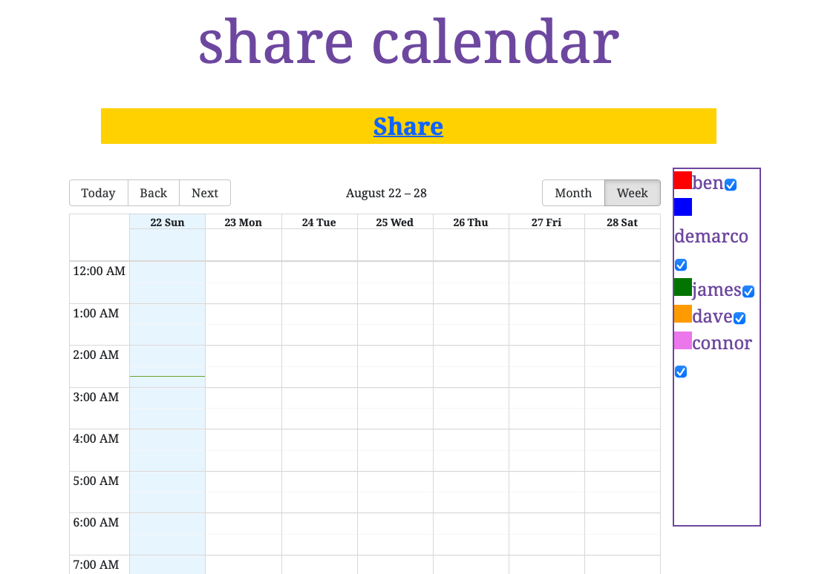

# Are You Taking (AYT) 📅🤔

<p style="text-align: center">
  
</p>

<p style="text-align: center"><i>Are You Taking (AYT)</i> is the world's first anti-scheduling application. It allows users to find courses they are taking with their friends easily!</p>

## Overview 🔍

A calendar application inspired by the experiences of fellow UBC students. It allows users to upload their course schedule or Google Calendar as an `.ics` file and share a custom calendar URL with friends. It's then easily to view course overlap and figure out who to study with.

In the future we hope to support different calendar sources and support calendar editing with the application itself.

## Features 👇

* Upload your calendar.ics file
* Share your calendar with friends
* Compare your calendars
* Toggle displayed users

### Homepage 🏠

This is the homepage, structured a bit like when2meet.

<p style="text-align: center">
  
</p>

### Share 📤

This page pops up after a calendar upload.

<p style="text-align: center">
  
</p>

## Tech Stack ⌨️

- **Client:** JavaScript (React), Next, Sass, react-big-calendar, react-bootstrap
- **Server:** Python (Flask), CockroachDB, Docker, Google Cloud Platform

## Run Locally

TODO!

## Authors 🧑‍💻👩‍💻

- [@michaeldemarco](https://github.com/michaelfromyeg)
- [@benvinnick](https://github.com/bonvee-99)

## Notes

Any development notes.

### CockroachDB

Here are the steps needed to install CockroachDB. Note the password is missing.

```shellscript
curl https://binaries.cockroachdb.com/cockroach-v21.1.7.linux-amd64.tgz | tar -xz; sudo cp -i cockroach-v21.1.7.linux-amd64/cockroach /usr/local/bin/
curl --create-dirs -o $HOME/.postgresql/root.crt -O https://cockroachlabs.cloud/clusters/bc87538b-7a2f-42d4-a7b8-8849964ec9ac/cert
cockroach sql --url 'postgresql://michael:<PASSWORD>@free-tier.gcp-us-central1.cockroachlabs.cloud:26257/defaultdb?sslmode=verify-full&sslrootcert='$HOME'/.postgresql/root.crt&options=--cluster%3Dvalid-baboon-3069'
```

## Contributing

TODO!
